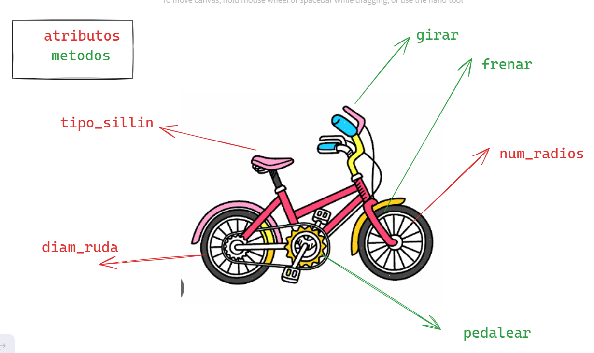
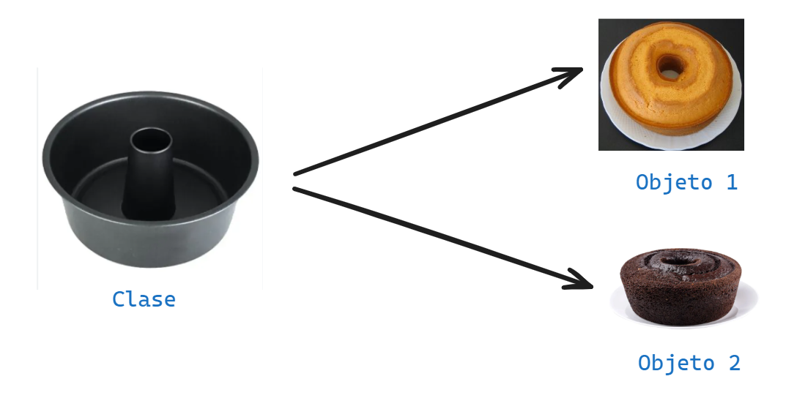

# POO - PROGRAMACION ORIENTADA A OBJETOS
la programacion orientada  a opjetos -`poo`en su sigle ingles `oop`, es una manera de programar (paradigma*), que permite llevar al codigo mecanismos usados con entidades de la vida real.

**sus benificios son siguiente:**
1. Encapsulamiento: permite `empaquetar` el codigo dentro de una unidad (objeto) donde se puede determinar el ambito  de actuacion 
2. Abstraccion. Permite `generaliza` los tipos de objetos a traves de las clases y simplificar el programa. 
3. Herencia: Permite `reutilizar` codigo al poder heredar atributos y compartamientos de una clase 
4. Polimorfismo: Permite `crear` mutiplos onjetos a patir de una misma pieza flexible de codigo.
existen dos pilar mas que a este nivel que estan mis alumnitos van a pujar.
existen dos que a nivel educativo no es necsario aprenderlo. 
5. Acoplamiento
6. cohesion

## Que es un objeto 
Un `objeto` es un tipo de dato estructurado que contiene o almacena `datos` y `codigo`.

|Elementos|Que Son  |Como se llama|Como se identifica  |
|---------|---------|-------------|--------------------|
|Dato     |variable |Atributos    |Mediante sustantivos|
|codigo   |Funcion  |Metodo       |Mediante verbos     | 
 
Un objeto representa un`instancia unica` de alguna `entidad`
a travez de sus atributos e interactua con otros objetos o con si mismo a traves de sus metodos. 

## Que es una clase 
Para crear un `objeto` primero devemos definir la `clase`.
 para responder la pregunta de alex, debemos pensar en la `clase` como el `molde` con el que se creean nuevo objetos. 
En el el proceso de diseño  de una clase hay que tener encuenta  el `principio de responsabilidad unica`, esto intentando que los `atributos` y los `metodos` esten efocados en un objetivo unico y vien difinido.

>[!TIP]
> Un paradigma de programacion es un metodo, tecnica o estilo de programar. Muchos de los lenguajes de programacion son creados en base a un paradigma, ejemplo java es un lenguaje que adopta el paradigma POO(Programacion Orienda a Objetos). Sin embargo existen lenguajes de programacion que adoptan varios paradigmas como es el caso de python y javascript estos son lenguajes multiparadigmas